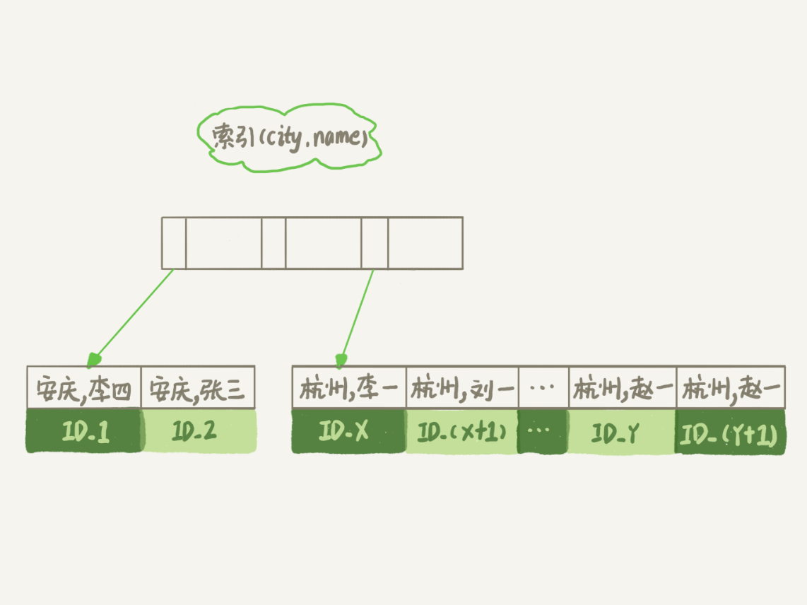

# order by 排序

假设这个表的部分定义是这样的：

```sql
CREATE TABLE `t` (
    `id` int(11) NOT NULL,
    `city` varchar(16) NOT NULL,
    `name` varchar(16) NOT NULL,
    `age` int(11) NOT NULL,
    `addr` varchar(128) DEFAULT NULL,
    PRIMARY KEY (`id`),
    KEY `city` (`city`)
) ENGINE=InnoDB;
```

这时，你的 SQL 语句可以这么写：

```sql
select city,name,age from t where city='杭州' order by name limit 1000  ;
```

为避免全表扫描，我们需要在 city 字段加上索引。


## 全字段排序

在 city 字段上创建索引之后，我们用 explain 命令来看看这个语句的执行情况。


Extra 这个字段中的“Using filesort”表示的就是需要排序，**<u>MySQL 会给每个线程分配一块内存用于排序，称为 sort_buffer</u>**。


通常情况下，这个语句执行流程如下所示 ：

1. 初始化 sort_buffer，确定放入 name、city、age 这三个字段；
2. 从索引 city 找到第一个满足 city='杭州’条件的主键 id，也就是图中的 ID_X；
3. 到主键 id 索引取出整行，取 name、city、age 三个字段的值，存入 sort_buffer 中；
4. 从索引 city 取下一个记录的主键 id；
5. 重复步骤 3、4 直到 city 的值不满足查询条件为止，对应的主键 id 也就是图中的 ID_Y；
6. 对 sort_buffer 中的数据按照字段 name 做快速排序；
7. 按照排序结果取前 1000 行返回给客户端。

我们暂且把这个排序过程，称为全字段排序。“按 name 排序”这个动作，**<u>可能在内存中完成，也可能需要使用外部排序，这取决于排序所需的内存和参数 sort_buffer_size</u>**。sort_buffer_size，就是 MySQL 为排序开辟的内存（sort_buffer）的大小。如果要排序的数据量小于 sort_buffer_size，排序就在内存中完成。但如果排序数据量太大，内存放不下，则不得不利用磁盘临时文件辅助排序。


## rowid 排序

在上面这个算法过程里面，只对原表的数据读了一遍，剩下的操作都是在 sort_buffer 和临时文件中执行的。但这个算法有一个问题，就是如果查询要返回的字段很多的话，那么 sort_buffer 里面要放的字段数太多，这样内存里能够同时放下的行数很少，要分成很多个临时文件，排序的性能会很差。

所以如果单行很大，这个方法效率不够好。那么，**如果 MySQL 认为排序的单行长度太大会怎么做呢？**

通过修改一个参数，让 MySQL 采用另外一种算法。

```sql
SET max_length_for_sort_data = 16;
```

max_length_for_sort_data，是 MySQL 中专门控制用于排序的行数据的长度的一个参数。它的意思是，如果单行的长度超过这个值，MySQL 就认为单行太大，要换一个算法。city、name、age 这三个字段的定义总长度是 36，我把 max_length_for_sort_data 设置为 16，我们再来看看计算过程有什么改变。

新的算法放入 sort_buffer 的字段，只有要排序的列（即 name 字段）和主键 id。但这时，排序的结果就因为少了 city 和 age 字段的值，不能直接返回了，整个执行流程就变成如下所示的样子：

1. 初始化 sort_buffer，确定放入两个字段，即 name 和 id；
2. 从索引 city 找到第一个满足 city='杭州’条件的主键 id，也就是图中的 ID_X；
3. 到主键 id 索引取出整行，取 name、id 这两个字段，存入 sort_buffer 中；
4. 从索引 city 取下一个记录的主键 id；重复步骤 3、4 直到不满足 city='杭州’条件为止，也就是图中的 ID_Y；
5. 对 sort_buffer 中的数据按照字段 name 进行排序；
6. 遍历排序结果，取前 1000 行，并按照 id 的值回到原表中取出 city、name 和 age 三个字段返回给客户端。

这个执行流程的示意图如下，我把它称为 rowid 排序。

对比全字段排序流程图你会发现，**<u>rowid 排序多访问了一次表 t 的主键索引</u>**，就是步骤 7。需要说明的是，最后的“结果集”是一个逻辑概念，实际上 MySQL 服务端从排序后的 sort_buffer 中依次取出 id，然后到原表查到 city、name 和 age 这三个字段的结果，不需要在服务端再耗费内存存储结果，是直接返回给客户端的。


## 全字段排序 VS rowid 排序

如果 MySQL 实在是担心排序内存太小，会影响排序效率，才会采用 rowid 排序算法，这样排序过程中一次可以排序更多行，但是需要再回到原表去取数据。

如果 MySQL 认为内存足够大，会优先选择全字段排序，把需要的字段都放到 sort_buffer 中，这样排序后就会直接从内存里面返回查询结果了，不用再回到原表去取数据。这也就体现了 MySQL 的一个设计思想：<u>**如果内存够，就要多利用内存，尽量减少磁盘访问**</u>。

<u>**对于 InnoDB 表来说，rowid 排序会要求回表多造成磁盘读，因此不会被优先选择。**</u>


看到这里，你就了解了，MySQL 做排序是一个成本比较高的操作。那么你会问，是不是所有的 order by 都需要排序操作呢？<u>**如果不排序就能得到正确的结果，那对系统的消耗会小很多，语句的执行时间也会变得更短。**</u>其实，并不是所有的 order by 语句，都需要排序操作的。从上面分析的执行过程，我们可以看到，MySQL 之所以需要生成临时表，并且在临时表上做排序操作，其原因是原来的数据都是无序的。你可以设想下，如果能够保证从 city 这个索引上取出来的行，天然就是按照 name 递增排序的话，是不是就可以不用再排序了呢？确实是这样的。所以，我们可以在这个市民表上创建一个 city 和 name 的<u>**联合索引**</u>，对应的 SQL 语句是：

```sql
alter table t add index city_user(city, name);
```



在这个索引里面，我们依然可以用树搜索的方式定位到第一个满足 city='杭州’的记录，并且额外确保了，接下来按顺序取“下一条记录”的遍历过程中，只要 city 的值是杭州，name 的值就一定是有序的。这样整个查询过程的流程就变成了：

1. 从索引 (city,name) 找到第一个满足 city='杭州’条件的主键 id；
2. 到主键 id 索引取出整行，取 name、city、age 三个字段的值，作为结果集的一部分直接返回；
3. 从索引 (city,name) 取下一个记录主键 id；
4. 重复步骤 2、3，直到查到第 1000 条记录，或者是不满足 city='杭州’条件时循环结束。

可以看到，这个查询过程不需要临时表，也不需要排序。而且由于 (city,name) 这个联合索引本身有序，所以这个查询也不用把 4000 行全都读一遍，只要找到满足条件的前 1000 条记录就可以退出了。也就是说，在我们这个例子里，只需要扫描 1000 次。
